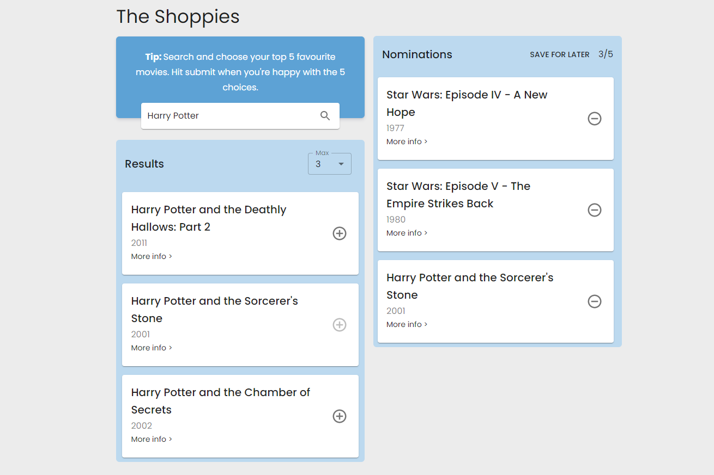

# The Shoppies

Created a responsive web app in React that enables users to nominate their 5 favourite movies for The Shoppies!

## Hosted at (https://prashkethshopify.netlify.app/)

## Table of Contents

- [Challenge](#Challenge)
- [Tech Used](#Tech-Used)
- [Features](#Features)

---

## Challenge

Create a webpage that can search [OMDB](http://www.omdbapi.com) for movies, and allow the user to save their favourite films they feel should be up for nomination. When they've selected 5 nominees they should be notified they're finished

### Technical Requirements

- Search results should come from OMDB's API
- Each search result should list at least its title, year of release and a button to nominate that film.
- Updates to the search terms should update the result list
- Movies in search results can be added and removed from the nomination list.
- If a search result has already been nominated, disable its nominate button.
- Display a banner when the user has 5 nominations.

### Extras

Improvements to design and functionality are allowed to be added in order to highlight passion and skills.

---

## Tech Used

- React.js
- React Hooks
- MaterialUI (+ makestyles and components)
- MaterialUI Icons
- Netlify
- LocalStorage

---

## Features

- Designed application to be responsive and functional (Mobile + Desktop)

- Added pop-up banner for mobile view that occurs when 5 movies have been nominated
- Added ability to save nominations for later (appears after at least 1 movie has been nominated)
- Users are able to submit nominations once 5 movies have been selected

- Added loading wheel that appears briefly after each search request
- Users are able to limit the amount of search results that are shown
- Users can view more information about a title by clicking the 'More info >' link for each movie
